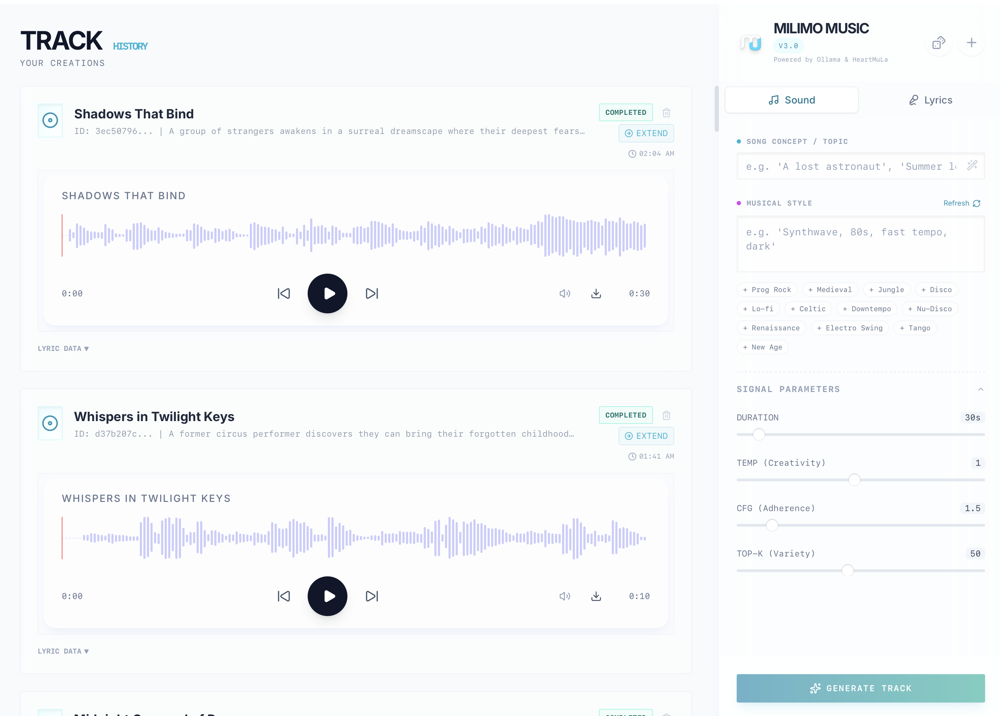

# Milimo Music

A music generation application powered by Ollama & HeartMuLa models.



## Features & Architecture Deep Dive

### Core Technology
Milimo Music integrates state-of-the-art AI models to provide a seamless music creation experience.

-   **[HeartMuLa-3B Model](https://github.com/HeartMuLa/heartlib)**: The heart of the audio generation engine. HeartMuLa (Hear the Music Language) is a 3B parameter transformer model capable of generating high-fidelity music conditioned on lyrics and stylistic tags.
-   **Audio Codec**: Uses `HeartCodec` (12.5 Hz) for efficient and high-quality audio reconstruction.
-   **Ollama Integration**: Leverages local LLMs (like Llama 3) for:
    -   **Lyrics Generation**: Automatically writes structured lyrics (Verse, Chorus, Bridge) based on a topic.
    -   **Prompt Enhancement**: Expands simple concepts into detailed musical descriptors.
    -   **Auto-Titling**: Generates creative titles based on the song content.
    -   **Inspiration Mode**: Brainstorms unique song concepts and style combinations for you.

### Key Capabilities

1.  **Text-to-Music Generation**: Create full 48kHz stereo tracks by simply describing a mood and style.
2.  **Lyrics-Conditioned Synthesis**: The model aligns generated audio with provided lyrics, respecting prosody and structure.
3.  **Track Extension**: Continue generating from where a previous track left off, allowing for the creation of longer compositions segment by segment.
    <br>
    [](https://youtu.be/Yppfm86lgk0)
4.  **Real-Time Progress**: Server-Sent Events (SSE) provide live feedback on the generation steps, from token inference to decoding.
5.  **Smart History**: Automatically saves all generated tracks, lyrics, and metadata (seed, cfg, temperature) for easy retrieval and playback.

## Prerequisites

- **Conda** (Anaconda or Miniconda)
- Python 3.10+
- Node.js 18+
- npm or yarn
- **Ollama** (Required for lyrics generation)

## Setup Instructions

### 1. Environment Setup

It is highly recommended to use a Conda environment to manage dependencies.

```bash
conda create -n milimo python=3.12
conda activate milimo
```

### 2. Ollama Setup (Required)

1.  Download and install [Ollama](https://ollama.com/) for your operating system.
2.  Pull a compatible model (e.g., Llama 3.2):
    ```bash
    ollama pull llama3.2:3b-instruct-fp16
    ```
3.  Ensure Ollama is running in the background:
    ```bash
    ollama run llama3.2:3b-instruct-fp16
    ```

### 3. HeartLib & Model Weights

**Crucial Step**: You must download the large model weights manually as they are excluded from the repository.

**Crucial Step**: You must download the large model weights manually as they are excluded from the repository.

1.  **Download Pretrained Models**:
    You need to download the checkpoints into the `heartlib/ckpt` directory. You can use Hugging Face or ModelScope.

    **Using Hugging Face CLI:**
    ```bash
    # Install hf-hub if not present: pip install huggingface_hub[cli]

    hf download --local-dir './ckpt' 'HeartMuLa/HeartMuLaGen'
    hf download --local-dir './ckpt/HeartMuLa-oss-3B' 'HeartMuLa/HeartMuLa-oss-3B'
    hf download --local-dir './ckpt/HeartCodec-oss' 'HeartMuLa/HeartCodec-oss'
    ```

    **Directory Structure Verification**:
    After downloading, ensure your `heartlib/ckpt` folder looks like this:
    ```
    heartlib/ckpt/
    ├── HeartCodec-oss/
    ├── HeartMuLa-oss-3B/
    ├── gen_config.json
    └── tokenizer.json
    ```

### 4. Backend

1.  Navigate to the `backend` directory:
    ```bash
    cd ../backend
    ```

2.  Install dependencies (this will automatically install `heartlib`):
    ```bash
    pip install -r requirements.txt
    ```

3.  Run the server:
    ```bash
    python -m app.main
    ```
    The backend will start at `http://localhost:8000`.

### 5. Frontend

1.  Navigate to the `frontend` directory:
    ```bash
    cd ../frontend
    ```

2.  Install dependencies:
    ```bash
    npm install
    ```

3.  Start the development server:
    ```bash
    npm run dev
    ```
    The frontend will be available at `http://localhost:5173`.

## Author

**Mainza Kangombe**  
[LinkedIn Profile](https://www.linkedin.com/in/mainza-kangombe-6214295)
