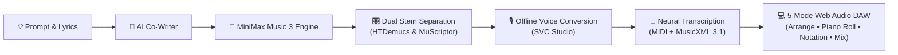

<div align="center">

# 🎵 Milimo Music

**Next-Generation AI Music Generation, Neural Transcription & Multitrack Production DAW**

Created by **[Mainza Kangombe](https://www.linkedin.com/in/mainza-kangombe-6214295)**

[](#license)
[](https://www.python.org/)
[](https://fastapi.tiangolo.com/)
[](https://react.dev/)
[](https://github.com/ml-explore/mlx)
[](#multi-platform-architecture)

<p align="center">
  <a href="#-overview">Overview</a> •
  <a href="#-key-features">Key Features</a> •
  <a href="#-system-architecture">Architecture</a> •
  <a href="#-quickstart">Quickstart</a> •
  <a href="#%EF%B8%8F-pro-media-transport-hotkeys">Hotkeys</a> •
  <a href="#-license">License</a>
</p>

</div>

---

## 🌟 Overview

**Milimo Music** is an open-source, production-grade AI music generation platform and digital audio workstation (DAW). It bridges the gap between state-of-the-art generative audio models and multitrack studio workflows — transforming natural language prompts and structured lyrics into 48kHz stereo masters, note-level polyphonic MIDI, dynamic Grand Staff sheet music, isolated neural stems, and voice-converted audio.


```mermaid
graph LR
    A["💡 Prompt & Lyrics"] --> B["🤖 AI Co-Writer"]
    B --> C["🎼 MiniMax Music 3 Engine"]
    C --> D["🎛️ Dual Stem Separation<br/>(HTDemucs & MuScriptor)"]
    D --> E["🎙️ Offline Voice Conversion<br/>(SVC Studio)"]
    E --> F["🎹 Neural Transcription<br/>(MIDI + MusicXML 3.1)"]
    F --> G["💻 5-Mode Web Audio DAW<br/>(Arrange • Piano Roll • Notation • Mix)"]
```

---

## ✨ Key Features

### 🎧 Generative Audio Engine & Pluggable Providers
- **MiniMax Music 3 Default Engine**: Conditioned on structured multi-section captions (`[Intro]`, `[Verse]`, `[Chorus]`, `[Solo]`, `[Outro]`) and acoustic style descriptors. Runs native **Apple Silicon MLX weight inference** (`mlx-community/MiniMax-Music3-bf16`) with automatic multi-platform CPU/CUDA fallbacks.
- **Self-Healing LLM Producer**: Automatically expands minimalist prompts into professional musical arrangements and generates structured lyrics, ensuring inference models always receive rich conditioning.
- **Precision Signal & Sampling Controls**: Full control over audio duration (5s–300s), CFG scale, temperature, top-k/top-p filtering, DiT diffusion steps, and seed locking.
- **Acoustic Inpainting & Extension**: Seamlessly extend existing tracks from their tail or regenerate designated glitch regions.

### 🎼 MuScriptor Neural Transcription & Engraving
- **Polyphonic Multi-Instrument Transcription**: Neural extraction of distinct instrument lines (Piano, Bass, Drums, Vocal melody).
- **Multi-Track MIDI (`.mid`) Export**: Fully compatible with Logic Pro, Ableton Live, FL Studio, and Pro Tools.
- **W3C MusicXML 3.1 Sheet Music (`.musicxml`)**: Automatic Grand Staff engraving with Treble (𝄞) and Bass (𝄢) clefs, key signatures, and measure deduplication.
- **Beat & Tempo Tracking**: Downbeat grid extraction, measure divisions, and BPM detection via `beat-this`.

### 🎛️ 5-Mode Web Audio DAW Workspace
- **Dual-Engine Stems**: Toggle between **4 Master Stems** (real HTDemucs neural source separation: vocals, drums, bass, other) and **Per-Instrument Parts** (MuScriptor transcription parts with General MIDI program badges).
- **Arrangement Timeline**: Multitrack stem lanes with real note-density overlays, Solo (`S`) / Mute (`M`) staging, and zoomable measure grid.
- **Piano Roll MIDI Editor**: 144px Apple Studio Grand Piano Keyboard with ivory/ebony keys, vertical measure divisions, live polyphonic Web Audio synth auditioning, interactive note editing, and bidirectional score synchronization.
- **Notation Viewer**: Dynamic SVG Grand Staff engraving with real diatonic pitch placement, curved flags, unified chord stems, and sheet music PDF downloads.
- **Multitrack Console Mixer**: Channel faders, stereo panning, animated LED peak meters, and Matchering reference mastering (-14.0 LUFS broadcast target).

### 🎙️ Voice Studio & Singing Voice Conversion (SVC)
- **Offline Vocal Cloning**: Transform vocal tracks into custom timbres using offline voice profiles.
- **Consent-Enforced Governance**: Cryptographic audio consent gating to ensure ethical vocal profile creation.

### 🎚️ Centralized Audio Engine & Pro Transport Suite
- **Single-Node Audio Engine**: Zero playback contention, ghost loops, or audio collisions via centralized `AudioEngineContext`.
- **Zero-Overlap Player Dock**: Rigid 3-zone flex layout with spinning vinyl disc artwork, timecode modes (elapsed/remaining), scrubber, playback speed (0.75x–2.0x), volume fader, Up Next Queue drawer, and synchronized LRC lyrics sheet.

---

## 🏗️ System Architecture

| Layer | Technologies & Frameworks | Description |
|---|---|---|
| **Frontend** | React 19, Vite, Tailwind CSS, Web Audio API | Apple-inspired interface, 5-mode DAW, floating dock player, interactive notation |
| **Backend** | FastAPI, SQLModel, SQLite, PyTorch, Librosa | REST API, async task execution, SSE progress streaming, audio pipeline |
| **Generative ML** | MLX (Apple Silicon), PyTorch (CUDA/CPU) | MiniMax Music 3, HeartMuLa-3B, HeartCodec |
| **Transcription** | MuScriptor, MuseScore 4, Mido, MusicXML 3.1 | Note-level neural transcription, score engraving, MIDI generation |
| **Separation** | HTDemucs (Meta Demucs v4), SoundFile, NumPy | High-fidelity 4-stem neural source separation |
| **LLM & Co-Writer** | OpenCode Go, OMLX, Ollama, OpenAI, Gemini | Prompt expansion, multi-agent lyricist engine, style tagging |

---

## 🚀 Quickstart

### Prerequisites
- **Python 3.10+** (Recommended: Python 3.12 via Conda)
- **Node.js 18+** & npm
- **Hardware**: macOS with Apple Silicon (M1/M2/M3/M4) or Linux/Windows with CUDA GPU

### 1. Clone Repository & Setup Conda

```bash
git clone --recurse-submodules https://github.com/mainza-ai/milimomusic.git
cd milimomusic

conda create -n milimomusic python=3.12 -y
conda activate milimomusic
```

### 2. Backend Initialization

```bash
cd backend
pip install -r requirements.txt
python -m uvicorn app.main:app --host 0.0.0.0 --port 8000
```
> Interactive OpenAPI documentation is accessible at `http://localhost:8000/docs`.

*(Optional — Native Apple Silicon MLX Acceleration)*:
```bash
echo 'MINIMAX_MODEL_PATH=mlx-community/MiniMax-Music3-bf16' >> .env
pip install mlx "mlx-audio @ git+https://github.com/Blaizzy/mlx-audio.git@784b29e2691a93ca7483147d86f61859dfaa6296"
```

### 3. Frontend Initialization

In a separate terminal window:

```bash
cd frontend
npm install
npm run dev
```
> Access the studio workstation at `http://localhost:5173`.

---

## ⌨️ Pro Media Transport Hotkeys

| Hotkey | Action |
|---|---|
| `Space` / `K` | Toggle Play / Pause |
| `Home` / `0` | Return to Start / Zero (`0:00`) |
| `J` / `ArrowLeft` | Rewind 10 Seconds |
| `L` / `ArrowRight` | Advance 10 Seconds |
| `[` / `]` | Previous Track / Next Track |
| `M` | Mute / Unmute Audio |
| `ArrowUp` / `ArrowDown` | Volume +/- 5% |

---

## 📄 License

Milimo Music is released under the **Non-Commercial Open Source License**. Developed by **[Mainza Kangombe](https://www.linkedin.com/in/mainza-kangombe-6214295)**.
