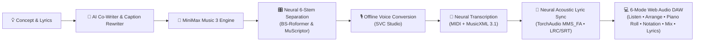
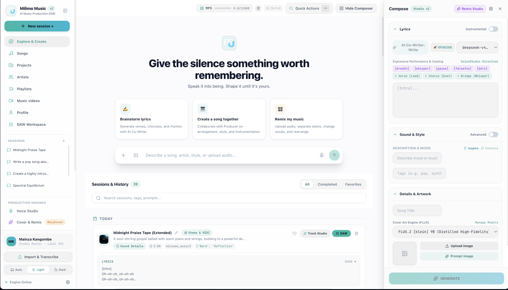
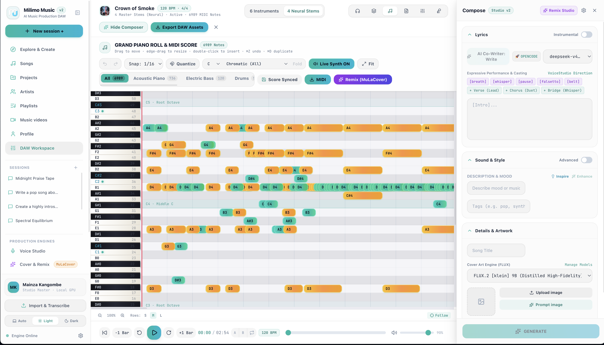
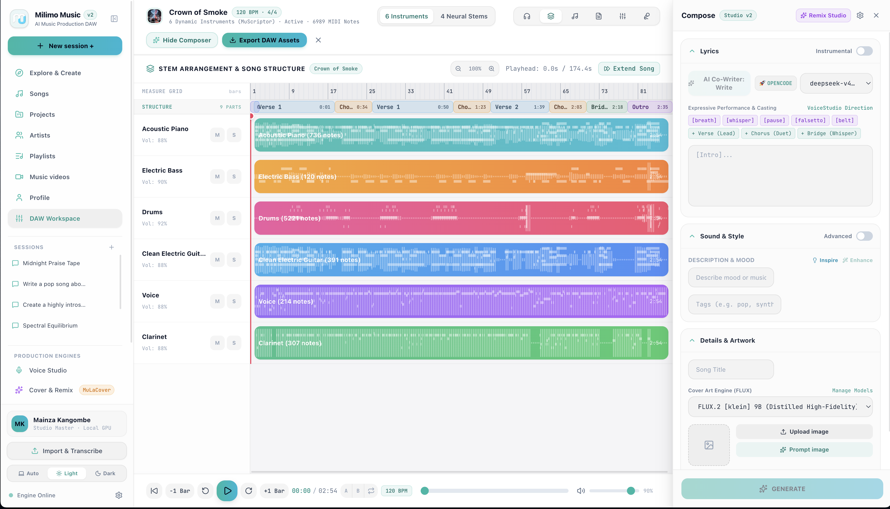
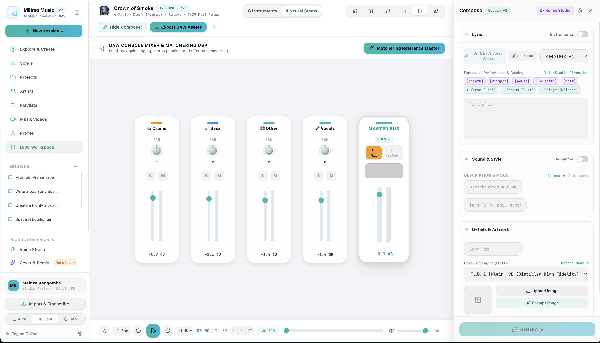
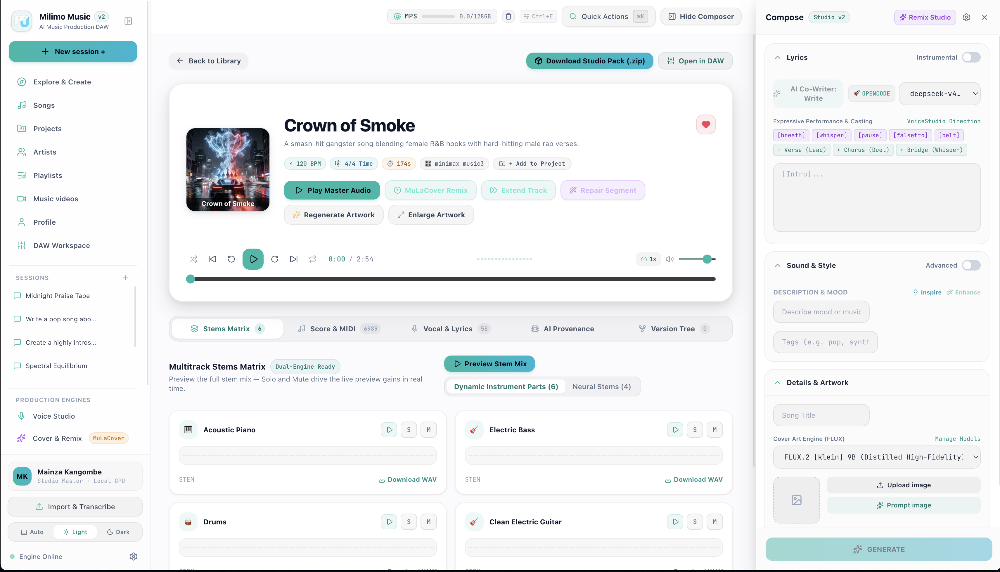
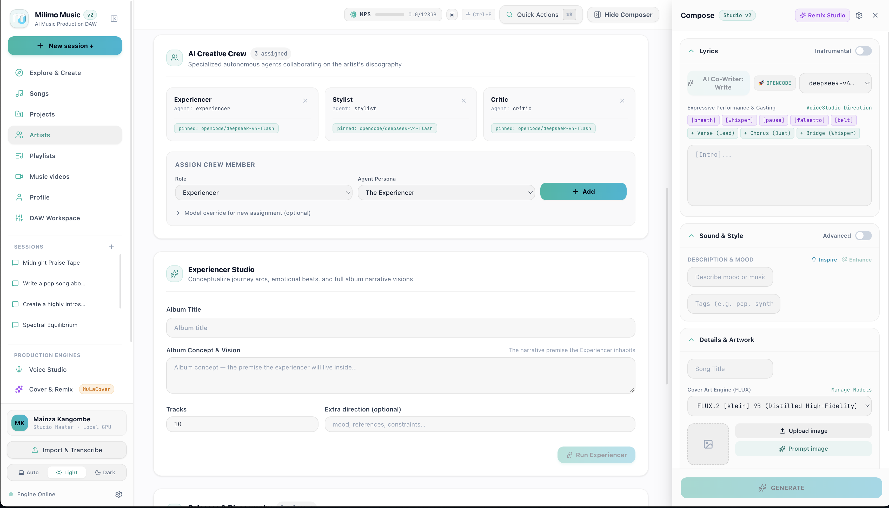
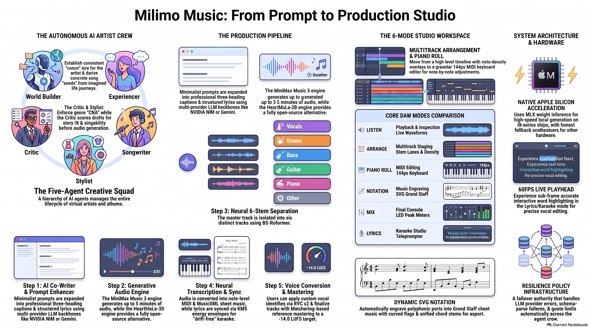

<div align="center">


# 🎵 Milimo Music

**Next-Generation AI Music Generation, Neural Transcription & Multitrack Production DAW**

Created by **[Mainza Kangombe](https://www.linkedin.com/in/mainza-kangombe-6214295)**

[](LICENSE)
[](https://www.python.org/)
[](https://fastapi.tiangolo.com/)
[](https://react.dev/)
[](https://github.com/ml-explore/mlx)
[](#multi-platform-architecture)

<p align="center">
  <a href="#-overview">Overview</a> •
  <a href="#-video-explainer--studio-walkthrough">Video Explainer</a> •
  <a href="#-studio-tour--workspace-modes">Studio Tour</a> •
  <a href="#%EF%B8%8F-studio-workflow--signal-architecture">Workflow</a> •
  <a href="#-key-features">Key Features</a> •
  <a href="#-system-architecture">Architecture</a> •
  <a href="#-quickstart">Quickstart</a> •
  <a href="#%EF%B8%8F-pro-media-transport-hotkeys">Hotkeys</a> •
  <a href="#-documentation--resources">Resources</a> •
  <a href="#-license">License</a>
</p>

</div>

---

## 🌟 Overview

**Milimo Music** is an open-source AI music generation platform and digital audio workstation (DAW). It bridges the gap between state-of-the-art generative neural models and professional multitrack studio workflows — transforming natural language prompts and structured lyrics into mastered stereo tracks, note-level polyphonic MIDI, dynamic Grand Staff sheet music, isolated neural stems, synchronized acoustic karaoke, and voice conversion tools.


```mermaid
graph LR
    A["💡 Concept & Lyrics"] --> B["🤖 AI Co-Writer & Caption Rewriter"]
    B --> C["🎼 MiniMax Music 3 Engine"]
    C --> D["🎛️ Neural 6-Stem Separation<br/>(BS-Roformer & MuScriptor)"]
    D --> E["🎙️ Offline Voice Conversion<br/>(SVC Studio)"]
    E --> F["🎹 Neural Transcription<br/>(MIDI + MusicXML 3.1)"]
    F --> G["🎤 Neural Acoustic Lyric Sync<br/>(TorchAudio MMS_FA • LRC/SRT)"]
    G --> H["💻 6-Mode Web Audio DAW<br/>(Listen • Arrange • Piano Roll • Notation • Mix • Lyrics)"]
```

---

## 🎬 Video Explainer & Studio Walkthrough

Watch the video breakdown and live workstation walkthrough of **Milimo Music v2** showcasing full prompt-to-production multitrack workflows:

<p align="center">
  <a href="https://youtu.be/Nsun12RGHi4" target="_blank">
    
  </a>
  <br />
  <em>▶️ <b><a href="https://youtu.be/Nsun12RGHi4" target="_blank">Watch: Milimo Music v2 — Major Update Walkthrough on YouTube</a></b></em>
</p>

---

## 📸 Studio Tour & Workspace Modes

Milimo Music features an Apple-grade, high-fidelity workstation bridging generative AI with tactile multitrack DAW precision:

### 1. Explore & Create Landing Hub
Natural language prompt composer, AI Co-Writer brainstorm assistant, real-time session feed, and quick action launchpads.

<p align="center">
  
</p>

### 2. Grand Piano Roll & Polyphonic MIDI Editor
144px interactive Studio Grand keyboard, note-by-note duration and velocity editing, live Web Audio polyphonic synth auditioning, and bidirectional score synchronization.

<p align="center">
  
</p>

### 3. Multitrack Stem Arrangement & Timeline
Dynamic per-instrument stem lanes (Piano, Drums, Voice, Clarinet, Guitar), real note-density waveforms, measure grids, and tactile Solo (`S`) / Mute (`M`) staging.

<p align="center">
  
</p>

### 4. DAW Console Mixer & Matchering Reference Master
Channel strip gain staging, stereo panning, animated LED peak meters, and Matchering reference mastering calibrated to a strict -14.0 LUFS broadcast target.

<p align="center">
  
</p>

### 5. Track Studio Deep-Drill & Dual-Engine Stems Matrix
Deep inspection of generated assets, stem mix preview with solo/mute auditioning, version trees, and one-click downloads for neural stems (`BS-Roformer`) and MIDI instrument parts (`MuScriptor`).

<p align="center">
  
</p>

### 6. Autonomous AI Artist Profiles & Creative Squad
Virtual artist identities with persistent world lore, style DNA, release catalog management, and assigned AI agent crews (World-Builder, Experiencer, Songwriter, Stylist, Critic).

<p align="center">
  
</p>

---

## 🗺️ Studio Workflow & Signal Architecture

Milimo routes raw creative intent through an interconnected neural pipeline, coordinated by an autonomous five-agent creative squad and culminating in the unified 6-mode DAW workspace.

<p align="center">
  
</p>

> 📚 **Comprehensive Architectural Deck**: Download the complete 15-slide technical breakdown:
> - [📄 **Milimo Neural DAW Architecture Specification (PDF)**](assets/misc/Milimo_Neural_DAW.pdf)
> - [📊 **Presentation Slides Deck (PPTX)**](assets/misc/Milimo_Neural_DAW.pptx)

---

## ✨ Key Features

### 🎧 Generative Audio Engine & Pluggable Providers
- **MiniMax Music 3 Default Engine**: Conditioned on structured multi-section captions (`[Intro]`, `[Verse]`, `[Chorus]`, `[Solo]`, `[Outro]`) and acoustic style descriptors. Runs native **Apple Silicon MLX weight inference** (`mlx-community/MiniMax-Music3-bf16`).
- **Strict Production Inference**: Configured with `MILIMO_STRICT_INFERENCE=1` to guarantee authentic neural generation on local hardware, eliminating silent procedural fallbacks.
  > **Platform note:** Real neural generation runs natively on Apple Silicon (MLX). On Windows/Linux the studio (DAW, transcription, mastering, agents) operates fully — with generation utilizing clearly-labeled placeholder synthesis when MLX is absent.

### 🤖 AI Co-Writer, Prompt Enhancer & Creative Squad
- **Autonomous AI Artist Crew**: Complete virtual artist lifecycle managed by specialized agents:
  - **World-Builder**: Establishes immutable canon lore, narrative themes, and aesthetic guards.
  - **Experiencer**: Conceives album visions and track seeds derived from the artist's imagined journey.
  - **Songwriter**: Crafts structured, rhymed, and metered lyrics adhering to section tags.
  - **Stylist**: Translates concept moods into 3-heading structured captions (`[Global Metadata]`, `[Vocal Details]`, `[Arrangement]`).
  - **Critic**: Evaluates lyrical drafts and musical cohesion with gated revision thresholds.
- **Multi-Provider LLM Integration**: Native support for **OpenCode Zen (DeepSeek v4 Flash)** as the default runtime baseline, alongside **NVIDIA NIM**, **OpenAI**, **Google Gemini**, **OMLX**, and **Ollama**.

### 🎛️ BS-Roformer Neural 6-Stem Source Separation
- **SOTA 6-Stem Separation**: Neural separation of the master audio into isolated **Vocals, Drums, Bass, Guitar, Piano, and Other** stems via BS-Roformer / MelBand-Roformer (`audio-separator`).
- **Hardware Acceleration**: Automatic native execution across CUDA, Apple Silicon MPS, and CPU.
- **Dual-Engine DAW Stems**: Toggle between **Neural Stems (BS-Roformer)** and **Dynamic Per-Instrument Parts (MuScriptor)**.

### 🎤 Neural Acoustic Lyrics & Forced Alignment
- **TorchAudio `MMS_FA` Forced Alignment**: Frame-level CTC acoustic alignment mapping tokenized words directly to isolated vocal stems with sub-100ms precision.
- **Multi-Interval Adaptive VAD**: Dynamic 75th-percentile energy thresholding preserving instrumental solos and pauses between stanzas.
- **Deconflicted Section Cues**: Section headers (`[Verse]`, `[Chorus]`, `[Outro]`) are isolated to preceding pauses and never steal active lyric highlights.
- **Live 60fps Playhead & Karaoke Export**: Sub-frame accurate interactive word highlighting in the Global Player and Studio Workspace, with one-click export for `.lrc` and `.srt` subtitle files.

### 🎼 MuScriptor Neural Transcription & Engraving
- **Polyphonic Multi-Instrument Transcription**: Neural extraction of distinct instrument lines (Piano, Bass, Drums, Vocal melody).
- **Multi-Track MIDI (`.mid`) Export**: Fully compatible with Logic Pro, Ableton Live, FL Studio, and Pro Tools.
- **W3C MusicXML 3.1 Sheet Music (`.musicxml`)**: Automatic Grand Staff engraving with Treble (𝄞) and Bass (𝄢) clefs, key signatures, and measure deduplication.
- **Beat & Tempo Tracking**: Downbeat grid extraction, measure divisions, and BPM detection via `beat-this`.

### 💻 6-Mode Web Audio DAW Workspace
- **Listen Mode**: High-fidelity stereo playback with live waveform visualization and metadata inspection.
- **Arrangement Timeline**: Multitrack stem lanes with real note-density overlays, Solo (`S`) / Mute (`M`) staging, and zoomable measure grid.
- **Piano Roll MIDI Editor**: 144px Apple Studio Grand Piano Keyboard with ivory/ebony keys, vertical measure divisions, live polyphonic Web Audio synth auditioning, interactive note editing, and bidirectional score synchronization.
- **Notation Viewer**: Dynamic SVG Grand Staff engraving with real diatonic pitch placement, curved flags, unified chord stems, and sheet music PDF downloads.
- **Multitrack Console Mixer**: Channel faders, stereo panning, animated LED peak meters, and Matchering reference mastering (-14.0 LUFS broadcast target).
- **Lyrics & Karaoke Studio**: Fullscreen live karaoke teleprompter with interactive line seeking and on-demand acoustic realignment.

### 🎙️ Voice Studio & Singing Voice Conversion (SVC)
- **Offline Vocal Cloning**: Transform vocal tracks into custom timbres using offline voice profiles.
- **RVC Neural Checkpoint Loader & Acoustic Formant EQ**: Supports real `.pth` model weights and profile-specific acoustic formant/presence equalization chains (`Aria` ethereal presence, `Marcus` warm soul resonance).
- **Consent-Enforced Governance**: Cryptographic audio consent gating to ensure ethical vocal profile creation.

### 🎬 AI Music Video Studio & Viseme Lip-Sync Pipeline
- **Generative Model Duration Constraints ("Locomotives")**: Bar-aligned musical segmentation respecting physical limits across frontier video models: **MiniMax Hailuo H3** (up to 15.0s), **Tencent HunyuanVideo** (up to 15.0s), **CogVideoX 1.5** (up to 10.0s), and **Wan 2.1** (up to 5.0s).
- **Isolated Vocal Stem Lip-Syncing**: Real RMS vocal energy envelope extraction with asymmetric ballistic smoothing, OpenCV Haar cascade facial landmark tracking, and frame-by-frame viseme mouth aperture deformation.
- **Animated Karaoke Subtitles**: Advanced SubStation Alpha (`.ass`) karaoke subtitle generation with luminous highlight tags (`\k<duration>`) and studio typography.
- **Procedural B-Roll Visual Synthesizer**: Dynamic multi-axis Ken Burns motion with orbital sweep, style-matched color grading LUTs, and generative chromatic plasma.

### 📦 Multi-Modal Model Hub & Hugging Face Search
- **23-Model Multi-Modal Catalog**: Comprehensive support across Audio (MiniMax Music 3 MLX/CUDA/GGUF, HeartMuLa), Image (Black Forest Labs FLUX.2 klein/dev, FLUX.1 schnell, SDXL Turbo), and Video (MiniMax Hailuo H3, Wan 2.1, CogVideoX 1.5, HunyuanVideo).
- **Live Hugging Face Hub Search**: Integrated search (`GET /models/search`) with pipeline filter chips (`text-to-audio`, `text-to-image`, `text-to-video`) and direct repository downloader.
- **Custom Model Registry**: Stores user-downloaded models in `~/.milimomusic/models/custom_models.json`, dynamically registered into `ProviderRegistry` via `HuggingFaceAudioProvider`.
- **Strict Download Policy**: Auto-downloads only the single smallest audio model on empty systems; all image and video models are strictly on-demand.

### 🎨 Cover Art Studio (Black Forest Labs FLUX.2 & SDXL Turbo)
- **Neural Image Diffusion**: Integrated `diffusers.AutoPipelineForText2Image` execution on MPS/CUDA with fp16 acceleration.
- **Studio-Grade Raster PNG Synthesis**: 1024x1024 cover art generation with multi-stop harmonic color gradients, textured noise, ambient vignettes, and vinyl groove rings.

### 🚀 Production Single-Process Serving & Multi-Stage Docker
- **Single-Process Web Serving**: Production FastAPI server mounts the compiled React 19 SPA from `frontend/dist` with client-side history API fallback on port `8000`.
- **Multi-Stage Docker Packaging**: Production `Dockerfile` and `docker-compose.yml` with auto NVIDIA GPU / CPU detection and host gateway LLM networking (`host.docker.internal`).


---

## 🏗️ System Architecture

| Layer | Technologies & Frameworks | Description |
|---|---|---|
| **Frontend** | React 19, Vite, Tailwind CSS, Web Audio API | Apple-inspired interface, 6-mode DAW, floating dock player, interactive notation |
| **Backend** | FastAPI, SQLModel, SQLite, PyTorch, Librosa | REST API, async task execution, SSE progress streaming, audio pipeline |
| **Generative ML** | MLX (Apple Silicon), PyTorch (CUDA/CPU) | MiniMax Music 3, HeartMuLa-3B, HeartCodec |
| **Separation** | BS-Roformer, MelBand-Roformer, audio-separator | 6-stem neural source separation (Vocals, Drums, Bass, Guitar, Piano, Other) |
| **Transcription** | MuScriptor, MuseScore 4, Mido, MusicXML 3.1 | Note-level neural transcription, score engraving, MIDI generation |
| **Lyric Sync** | TorchAudio MMS_FA, Adaptive VAD, LRC/SRT Generator | Acoustic forced alignment, progressive word timing |
| **LLM & Co-Writer** | OpenCode Zen (DeepSeek v4 Flash), NVIDIA NIM, Gemini, OpenAI | Structured caption rewriter, multi-agent lyricist crew, style tagging |

---

## 🖥️ System Requirements

Milimo Music is a high-performance neural workstation designed to scale from local developer machines and workstations to enterprise GPU cloud instances. Depending on your operational requirements (real-time neural generation, 6-stem separation, video rendering, or pure DAW editing), review the hardware tiers below:

### Hardware Specifications

| Component | Minimum (DAW & Basic AI) | Recommended (Full Neural Production) | Cloud / Studio Ultra |
|:---|:---|:---|:---|
| **Operating System** | macOS 13.0+ (Ventura/Sonoma/Sequoia)<br>Ubuntu 22.04+ LTS / Debian 12<br>Windows 11 (WSL2 / Docker Desktop) | macOS 14.0+ (Sonoma/Sequoia)<br>Ubuntu 24.04 LTS (NVIDIA Driver 535+) | Linux Enterprise (Ubuntu / Rocky / RHEL)<br>with NVIDIA Container Toolkit |
| **Processor (CPU)** | 4 Cores (Apple M1 or x86_64 @ 2.5 GHz+) | 8+ Cores (Apple M2/M3/M4 Pro or Ryzen 7 / i7) | 16+ Cores (AMD EPYC / Intel Xeon) |
| **System Memory (RAM)** | **16 GB Unified / RAM** *(Required for BS-Roformer)* | **32 GB Unified / RAM** *(MiniMax Music 3 + DAW)* | **64 GB – 128 GB+ Unified / RAM** |
| **Neural Acceleration** | **Apple Silicon:** M1/M2/M3 (Unified Memory)<br>**NVIDIA GPU:** 8 GB VRAM (RTX 3060/4060, T4) | **Apple Silicon:** M2/M3/M4 Pro/Max (32GB+ Unified)<br>**NVIDIA GPU:** 16 GB+ VRAM (RTX 4080/4090, A4000) | **NVIDIA GPU:** 24 GB – 80 GB VRAM<br>(RTX 3090/4090, A5000, A100, H100, L4) |
| **Storage (NVMe SSD)** | **20 GB free space** | **60 GB free NVMe SSD** *(Model weights cache)* | **200 GB+ NVMe SSD** *(Full multi-modal library)* |
| **System Tooling** | Docker 24.0+ & Docker Compose v2<br>*(or Python 3.10–3.12, Node.js 18+, FFmpeg 6.0+)* | Docker 26.0+, NVIDIA Container Toolkit,<br>FFmpeg 6.1+ with libsndfile1 & FluidSynth | Docker 26.0+, Kubernetes / Compose v2,<br>High-speed local NVMe scratch volume |

### Neural Engine & Feature Acceleration Matrix

| Studio Engine / Feature | Apple Silicon (MLX / MPS) | NVIDIA GPU (CUDA) | CPU / Fallback Mode |
|:---|:---:|:---:|:---:|
| **MiniMax Music 3 Audio Generation** | ⚡ **Native MLX (Fastest)** | 🔄 **PyTorch / Container** | ⚠️ *Procedural Synthesizer Preview* |
| **BS-Roformer 6-Stem Source Separation** | ⚡ **Native MPS Accelerated** | ⚡ **Native CUDA Accelerated** | ⏱️ *Functional (CPU processing)* |
| **MuScriptor Neural MIDI & Sheet Music** | ⚡ **Accelerated** | ⚡ **Accelerated** | ⚡ **Real-time CPU execution** |
| **TorchAudio MMS_FA Forced Lyric Sync** | ⚡ **Accelerated** | ⚡ **Accelerated** | ⚡ **Real-time CPU execution** |
| **Cover Art Studio (FLUX.2 / SDXL Turbo)** | ⚡ **Native MPS fp16** | ⚡ **Native CUDA fp16** | ⚠️ *Procedural Vector / Canvas Art* |
| **AI Music Video Studio & Lip-Sync** | ⚡ **Hardware Video Tooling** | ⚡ **NVENC & CUDA Accelerated** | ⏱️ *Standard FFmpeg Processing* |
| **6-Mode DAW, Timeline & Matchering DSP** | ⚡ **Real-time (Web Audio)** | ⚡ **Real-time (Web Audio)** | ⚡ **Real-time (Web Audio)** |

> 💡 **Apple Silicon Advantage**: On Apple M-series Macs, Milimo Music leverages unified memory architecture via Apple MLX (`mlx-community/MiniMax-Music3-bf16`), enabling true 44.1kHz stereo full-track neural generation without requiring a discrete server GPU.

---

## 🚀 Quickstart

### 🐳 Option 1: Turnkey Docker Deployment (Recommended for Production & Cloud)

Milimo Music includes a production multi-stage [`Dockerfile`](Dockerfile) and unified [`docker-compose.yml`](docker-compose.yml) that packages the Python 3.11 backend, DSP audio binaries (`ffmpeg`, `libsndfile1`), and the compiled React 19 SPA into a single unified container running on port `8000`.

#### A. 1-Click Automated Startup (NVIDIA GPU or CPU Auto-Detection)
```bash
git clone --recurse-submodules https://github.com/mainza-ai/milimomusic.git
cd milimomusic

chmod +x docker-start.sh
./docker-start.sh
```
> The launcher script automatically detects NVIDIA Container Toolkit support and selects the GPU profile; otherwise, it seamlessly falls back to the CPU profile, launches the container in the background, and waits for the backend health check to pass.

#### B. Manual Docker Compose

**For NVIDIA GPU Acceleration (Linux / WSL2):**
```bash
docker compose up -d --build
```

**For CPU / Apple Silicon Docker Desktop / Standard Runners:**
```bash
docker compose -f docker-compose.cpu.yml up -d --build
```

#### Access & Container Operations
- **Studio DAW & Web App**: Open [**http://localhost:8000**](http://localhost:8000) in your browser (serves the complete DAW UI and REST API).
- **Interactive OpenAPI Docs**: [http://localhost:8000/docs](http://localhost:8000/docs).
- **Health Check**: `curl -f http://localhost:8000/health`
- **View Live Container Logs**: `docker compose logs -f` (or `docker compose -f docker-compose.cpu.yml logs -f`)
- **Stop Application**: `docker compose down`

#### Connecting Host Machine LLMs (Ollama / LM Studio)
The container includes `host.docker.internal:host-gateway` routing. When configuring LLM providers in the Milimo Music Settings modal:
- **Ollama**: Use base URL `http://host.docker.internal:11434`
- **LM Studio**: Use base URL `http://host.docker.internal:1234/v1`
- **OMLX Server**: Use base URL `http://host.docker.internal:8787/v1`

#### Persistent Volume Mapping
All generated audio, stems, database records, and downloaded model weights are preserved across container restarts:
- `milimo-data`: SQLite database (`database.db`), voice profiles, and custom models registry.
- `milimo-audio`: Rendered master audio, separated stems, converted vocals, and cover images.
- `milimo-hf-cache`: Hugging Face model weight cache (`~/.cache/huggingface`).

---

### 💻 Option 2: Local Native Setup (Recommended for Apple Silicon M1–M4 Native MLX)

#### Prerequisites
- **Python 3.10+** (Recommended: Python 3.12 via Conda)
- **Node.js ≥ 20.19** & npm (Vite 7 requirement)
- **Hardware**: macOS with Apple Silicon (M1/M2/M3/M4) or Linux/Windows with CUDA GPU

#### 1. Clone Repository & Setup Conda

```bash
git clone --recurse-submodules https://github.com/mainza-ai/milimomusic.git
cd milimomusic

conda create -n milimomusic python=3.12 -y
conda activate milimomusic
```

#### 2. Backend Initialization

```bash
cd backend
conda activate milimomusic
pip install -r requirements.txt
python -m uvicorn app.main:app --host 0.0.0.0 --port 8000
```
> Interactive OpenAPI documentation is accessible at `http://localhost:8000/docs`.

*(Native Apple Silicon MLX Acceleration)*:
```bash
echo 'MINIMAX_MODEL_PATH=mlx-community/MiniMax-Music3-bf16' >> ../.env
pip install mlx "mlx-audio @ git+https://github.com/Blaizzy/mlx-audio.git@784b29e2691a93ca7483147d86f61859dfaa6296"
./scripts/start-backend.sh
```

#### 3. Frontend Initialization

In a separate terminal window:

```bash
cd frontend
npm install
npm run dev
```
> Access the studio workstation at `http://localhost:5173`.

---

## 🔧 Operations

### Single-instance lock
The backend enforces an instance lock to prevent GPU and database contention:
- Stale locks (dead PID) are detected and reclaimed after a 30s grace period.
- Sandbox/CI override: `MILIMO_ALLOW_MULTI_INSTANCE=1`.
- Lock file location: `MILIMO_LOCK_FILE` (default `.milimo.lock`).

### Environment Reference
| Variable | Default | Purpose |
|---|---|---|
| `MILIMO_AUTH_TOKEN` | unset (open localhost) | Optional bearer-token auth for the API |
| `MILIMO_CORS_ORIGINS` | localhost allowlist | Explicit CORS origin list |
| `MILIMO_AGENT_TIMEOUT` | `60` | Per-attempt ceiling (s) for agent LLM calls |
| `MILIMO_RUN_RETENTION_DAYS` | `30` | Agent-ledger retention sweep at boot (`0` disables) |
| `MILIMO_MAX_DURATION_S` | `240` | Hard cap on generated track duration (s) |
| `MILIMO_STRICT_INFERENCE` | `1` | Enforces genuine neural inference (fails loudly if unavailable) |
| `MILIMO_LOCK_FILE` | `.milimo.lock` | Instance-lock file path |
| `MILIMO_ALLOW_MULTI_INSTANCE` | unset | Set to `1` to bypass the boot lock |

### Backing Up the Database
SQLite runs in WAL mode. Never copy active database files directly while the server is live. Take a consistent atomic snapshot with:
```bash
sqlite3 milimo.db "VACUUM INTO 'backup.db';"
```

---

## ⌨️ Pro Media Transport Hotkeys

| Hotkey | Action |
|---|---|
| `Space` / `K` | Toggle Play / Pause |
| `Home` / `0` | Return to Start / Zero (`0:00`) |
| `J` / `ArrowLeft` | Rewind 10 Seconds |
| `L` / `ArrowRight` | Advance 10 Seconds |
| `[` / `]` | Previous Track / Next Track |
| `M` | Mute / Unmute Audio |
| `ArrowUp` / `ArrowDown` | Volume +/- 5% |

---

## 📚 Documentation & Technical Wiki

Milimo Music maintains a comprehensive, LLM-curated **Technical Encyclopedia and Architecture Wiki** located in the [`wiki/`](wiki/index.md) directory, providing detailed specifications across all subsystems:

| Document | Description |
|---|---|
| 📖 [**Wiki Catalog (`wiki/index.md`)**](wiki/index.md) | Central table of contents and content-oriented navigation index |
| 🌐 [**Overview & Scope (`wiki/overview.md`)**](wiki/overview.md) | High-level synthesis, product philosophy, and technical boundaries |
| 🏗️ [**System Architecture (`wiki/architecture.md`)**](wiki/architecture.md) | Data flow pipelines, provider abstraction layer, and system topology |
| 🎬 [**AI Music Video Studio (`wiki/entities/video-studio.md`)**](wiki/entities/video-studio.md) | Duration constraints, viseme lip-syncing, ASS karaoke, and B-roll |
| 📦 [**Model Manager (`wiki/entities/model-manager.md`)**](wiki/entities/model-manager.md) | Multi-modal tree, Hugging Face Hub search, and download policies |
| 🎼 [**MiniMax Music 3 Engine (`wiki/entities/minimax-music3.md`)**](wiki/entities/minimax-music3.md) | Sampling parameters, structured captions, and MLX/DiT hooks |
| 🎙️ [**Voice Training Studio (`wiki/entities/voice-service.md`)**](wiki/entities/voice-service.md) | Offline singing voice conversion (SVC) and acoustic formant chains |
| 🤖 [**AI Co-Writer Engine (`wiki/entities/ai-cowriter.md`)**](wiki/entities/ai-cowriter.md) | Multi-agent lyric coordination graph (Lyricist, StructureGuard) |
| 🐳 [**Docker Deployment (`wiki/entities/docker-deployment.md`)**](wiki/entities/docker-deployment.md) | Turnkey multi-stage container build, GPU/CPU compose profiles, and volume persistence |
| 📋 [**Operations & Log (`wiki/log.md`)**](wiki/log.md) | Chronological append-only record of every architectural evolution |

### Additional Media & Specifications
- [🎬 **Milimo Music v2 Video Explainer & Walkthrough (YouTube)**](https://youtu.be/Nsun12RGHi4)
- [📄 **Milimo Neural DAW Architecture Specification (PDF)**](assets/misc/Milimo_Neural_DAW.pdf)
- [📊 **Presentation Slides Deck (PPTX)**](assets/misc/Milimo_Neural_DAW.pptx)
- [🗺️ **Studio Production Workflow Infographic**](assets/misc/AI_Music_Production_Studio_Workflow.png)


---

## 📄 License

The **Milimo Music** platform source code is released under the **[Apache License 2.0](LICENSE)**. Created and maintained by **[Mainza Kangombe](https://www.linkedin.com/in/mainza-kangombe-6214295)**.

> **Notice on Upstream Model Weights**: Pre-trained model weights utilized by the platform operate under their respective upstream licenses:
> - **MuScriptor Neural Transcription Weights**: Licensed by Kyutai × Mirelo under [Creative Commons Attribution-NonCommercial 4.0 (CC BY-NC 4.0)](https://creativecommons.org/licenses/by-nc/4.0/).
> - **MiniMax Music 3 Weights**: Governed by the MiniMax Open Weights License.
> 
> See [`LICENSES.md`](LICENSES.md) for the complete licensing matrix across all core components, third-party DSP engines, and AI models.


