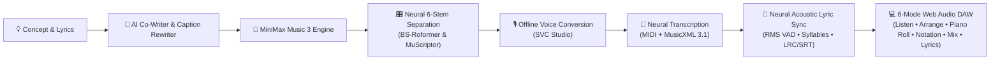

<div align="center">

# 🎵 Milimo Music

**Next-Generation AI Music Generation, Neural Transcription & Multitrack Production DAW**

Created by **[Mainza Kangombe](https://www.linkedin.com/in/mainza-kangombe-6214295)**

[](LICENSE)
[](https://www.python.org/)
[](https://fastapi.tiangolo.com/)
[](https://react.dev/)
[](https://github.com/ml-explore/mlx)
[](#multi-platform-architecture)

<p align="center">
  <a href="#-overview">Overview</a> •
  <a href="#-key-features">Key Features</a> •
  <a href="#-system-architecture">Architecture</a> •
  <a href="#-quickstart">Quickstart</a> •
  <a href="#%EF%B8%8F-pro-media-transport-hotkeys">Hotkeys</a> •
  <a href="#-license">License</a>
</p>

</div>

---

## 🌟 Overview

**Milimo Music** is an open-source, production-grade AI music generation platform and digital audio workstation (DAW). It bridges the gap between state-of-the-art generative audio models and multitrack studio workflows — transforming natural language prompts and structured lyrics into 48kHz stereo masters, note-level polyphonic MIDI, dynamic Grand Staff sheet music, isolated neural stems, synchronized acoustic karaoke, and voice-converted audio.


```mermaid
graph LR
    A["💡 Concept & Lyrics"] --> B["🤖 AI Co-Writer & Caption Rewriter"]
    B --> C["🎼 MiniMax Music 3 Engine"]
    C --> D["🎛️ Neural 6-Stem Separation<br/>(BS-Roformer & MuScriptor)"]
    D --> E["🎙️ Offline Voice Conversion<br/>(SVC Studio)"]
    E --> F["🎹 Neural Transcription<br/>(MIDI + MusicXML 3.1)"]
    F --> G["🎤 Neural Acoustic Lyric Sync<br/>(RMS VAD • Syllables • LRC/SRT)"]
    G --> H["💻 6-Mode Web Audio DAW<br/>(Listen • Arrange • Piano Roll • Notation • Mix • Lyrics)"]
```

---

## ✨ Key Features

### 🎧 Generative Audio Engine & Pluggable Providers
- **MiniMax Music 3 Default Engine**: Conditioned on structured multi-section captions (`[Intro]`, `[Verse]`, `[Chorus]`, `[Solo]`, `[Outro]`) and acoustic style descriptors. Runs native **Apple Silicon MLX weight inference** (`mlx-community/MiniMax-Music3-bf16`) with automatic multi-platform CPU/CUDA fallbacks.
### 🤖 AI Co-Writer, Prompt Enhancer & Caption Rewriter
- **Multi-Provider LLM Integration**: Native support for **NVIDIA NIM** (Llama 3.1/3.3, Nemotron, DeepSeek, Qwen), **OpenCode Go**, **DeepSeek**, **OpenAI**, **Google Gemini**, and local inference engines (**OMLX** for Apple Silicon and **Ollama**).
- **Dynamic Model Selection**: Live model discovery querying hosted APIs directly with zero hardcoded constraints.
- **Caption Rewriter & Self-Healing Producer**: Automatically expands minimalist prompts into professional 3-heading structured captions (`[Global Metadata]`, `[Vocal Details]`, `[Arrangement]`) and complete, structured lyrics with automatic multi-provider failover and keyword-aware style recovery.
- **Precision Signal & Sampling Controls**: Full control over audio duration (5s–300s), CFG scale, temperature, top-k/top-p filtering, DiT diffusion steps, and seed locking.
- **Acoustic Inpainting & Extension**: Seamlessly extend existing tracks from their tail or regenerate designated glitch regions.

### 🎛️ BS-Roformer Neural 6-Stem Source Separation
- **SOTA 6-Stem Separation**: Neural separation of the master audio into isolated **Vocals, Drums, Bass, Guitar, Piano, and Other** stems via BS-Roformer / MelBand-Roformer (`audio-separator`).
- **Hardware Acceleration**: Automatic native execution across CUDA, Apple Silicon MPS, and CPU.
- **Dual-Engine DAW Stems**: Toggle between **Neural Stems (BS-Roformer)** and **Dynamic Per-Instrument Parts (MuScriptor)**.

### 🎤 Neural Acoustic Lyrics & Karaoke Synchronization
- **Acoustic Vocal Energy Extraction**: RMS amplitude envelopes on isolated vocal stems for drift-free timing during instrumental solos and intros.
- **Voice Activity Detection & Syllables**: Syllable-weighted word distribution ensuring natural singing cadence.
- **Live 60fps Playhead**: Sub-frame accurate interactive word highlighting in the Global Player and Studio Workspace.
- **Industry Subtitle Export**: One-click download of synchronized `.lrc` and `.srt` lyric files.

### 🎼 MuScriptor Neural Transcription & Engraving
- **Polyphonic Multi-Instrument Transcription**: Neural extraction of distinct instrument lines (Piano, Bass, Drums, Vocal melody).
- **Multi-Track MIDI (`.mid`) Export**: Fully compatible with Logic Pro, Ableton Live, FL Studio, and Pro Tools.
- **W3C MusicXML 3.1 Sheet Music (`.musicxml`)**: Automatic Grand Staff engraving with Treble (𝄞) and Bass (𝄢) clefs, key signatures, and measure deduplication.
- **Beat & Tempo Tracking**: Downbeat grid extraction, measure divisions, and BPM detection via `beat-this`.

### 💻 6-Mode Web Audio DAW Workspace
- **Listen Mode**: High-fidelity stereo playback with live waveform visualization and metadata inspection.
- **Arrangement Timeline**: Multitrack stem lanes with real note-density overlays, Solo (`S`) / Mute (`M`) staging, and zoomable measure grid.
- **Piano Roll MIDI Editor**: 144px Apple Studio Grand Piano Keyboard with ivory/ebony keys, vertical measure divisions, live polyphonic Web Audio synth auditioning, interactive note editing, and bidirectional score synchronization.
- **Notation Viewer**: Dynamic SVG Grand Staff engraving with real diatonic pitch placement, curved flags, unified chord stems, and sheet music PDF downloads.
- **Multitrack Console Mixer**: Channel faders, stereo panning, animated LED peak meters, and Matchering reference mastering (-14.0 LUFS broadcast target).
- **Lyrics & Karaoke Studio**: Fullscreen live karaoke teleprompter with interactive line seeking and on-demand acoustic realignment.

### 🎙️ Voice Studio & Singing Voice Conversion (SVC)
- **Offline Vocal Cloning**: Transform vocal tracks into custom timbres using offline voice profiles.
- **Consent-Enforced Governance**: Cryptographic audio consent gating to ensure ethical vocal profile creation.

---

## 🏗️ System Architecture

| Layer | Technologies & Frameworks | Description |
|---|---|---|
| **Frontend** | React 19, Vite, Tailwind CSS, Web Audio API | Apple-inspired interface, 6-mode DAW, floating dock player, interactive notation |
| **Backend** | FastAPI, SQLModel, SQLite, PyTorch, Librosa | REST API, async task execution, SSE progress streaming, audio pipeline |
| **Generative ML** | MLX (Apple Silicon), PyTorch (CUDA/CPU) | MiniMax Music 3, HeartMuLa-3B, HeartCodec |
| **Separation** | BS-Roformer, MelBand-Roformer, audio-separator | 6-stem neural source separation (Vocals, Drums, Bass, Guitar, Piano, Other) |
| **Transcription** | MuScriptor, MuseScore 4, Mido, MusicXML 3.1 | Note-level neural transcription, score engraving, MIDI generation |
| **Lyric Sync** | RMS Energy Envelope, VAD, LRC/SRT Generator | Acoustic karaoke alignment, progressive word timing |
| **LLM & Co-Writer** | NVIDIA NIM, OpenCode Go, DeepSeek, OMLX, Ollama, OpenAI, Gemini | Structured caption rewriter, multi-agent lyricist engine, style tagging |

---

## 🚀 Quickstart

### Prerequisites
- **Python 3.10+** (Recommended: Python 3.12 via Conda)
- **Node.js 18+** & npm
- **Hardware**: macOS with Apple Silicon (M1/M2/M3/M4) or Linux/Windows with CUDA GPU

### 1. Clone Repository & Setup Conda

```bash
git clone --recurse-submodules https://github.com/mainza-ai/milimomusic.git
cd milimomusic

conda create -n milimomusic python=3.12 -y
conda activate milimomusic
```

### 2. Backend Initialization

#### Option A: Apple Silicon (macOS M1 / M2 / M3 / M4) with MLX Acceleration (Recommended)

Milimo Music runs natively on Apple Silicon with unified memory via **Apple MLX** (`mlx-audio`):

1. **Install Dependencies & MLX Audio Engine**:
   ```bash
   cd backend
   conda activate milimomusic
   pip install -r requirements.txt
   pip install mlx "mlx-audio @ git+https://github.com/Blaizzy/mlx-audio.git@784b29e2691a93ca7483147d86f61859dfaa6296"
   ```

2. **Download MiniMax Music 3 MLX Weights**:
   ```bash
   # Download the native 16-bit MLX weights snapshot from Hugging Face:
   pip install huggingface_hub
   huggingface-cli download mlx-community/MiniMax-Music3-bf16
   ```

3. **Configure Environment Variables**:
   Copy `.env.example` to `.env` in the project root:
   ```bash
   cp ../.env.example ../.env
   ```
   Set `MINIMAX_MODEL_PATH` to your downloaded snapshot path (or model ID) in `../.env`:
   ```bash
   # Example:
   # MINIMAX_MODEL_PATH=/Users/<username>/.cache/huggingface/hub/models--mlx-community--MiniMax-Music3-bf16/snapshots/<snapshot-id>
   ```

4. **Launch Backend Server**:
   ```bash
   PYTHONPATH=.:../muscriptor python -m uvicorn app.main:app --host 0.0.0.0 --port 8000 --reload
   ```

*(Optional — Run Local Apple Silicon Lyrics LLM with OMLX)*:
```bash
pip install omlx
omlx --model mlx-community/Llama-3.2-3B-Instruct-bf16 --port 8787
```

---

#### Option B: Standard / Linux / CUDA / CPU Setup

```bash
cd backend
conda activate milimomusic
pip install -r requirements.txt
PYTHONPATH=.:../muscriptor python -m uvicorn app.main:app --host 0.0.0.0 --port 8000 --reload
```

> Interactive OpenAPI documentation is accessible at `http://localhost:8000/docs`.

### 3. Frontend Initialization

In a separate terminal window:

```bash
cd frontend
npm install
npm run dev
```
> Access the studio workstation at `http://localhost:5173`.

---

## ⌨️ Pro Media Transport Hotkeys

| Hotkey | Action |
|---|---|
| `Space` / `K` | Toggle Play / Pause |
| `Home` / `0` | Return to Start / Zero (`0:00`) |
| `J` / `ArrowLeft` | Rewind 10 Seconds |
| `L` / `ArrowRight` | Advance 10 Seconds |
| `[` / `]` | Previous Track / Next Track |
| `M` | Mute / Unmute Audio |
| `ArrowUp` / `ArrowDown` | Volume +/- 5% |

---

## 📄 License

The **Milimo Music** platform source code is released under the **[Apache License 2.0](LICENSE)**. Created and maintained by **[Mainza Kangombe](https://www.linkedin.com/in/mainza-kangombe-6214295)**.

> **Notice on Upstream Model Weights**: Pre-trained model weights utilized by the platform operate under their respective upstream licenses:
> - **MuScriptor Neural Transcription Weights**: Licensed by Kyutai × Mirelo under [Creative Commons Attribution-NonCommercial 4.0 (CC BY-NC 4.0)](https://creativecommons.org/licenses/by-nc/4.0/).
> - **MiniMax Music 3 Weights**: Governed by the MiniMax Open Weights License.
> 
> See [`LICENSES.md`](LICENSES.md) for the complete licensing matrix across all core components, third-party DSP engines, and AI models.

