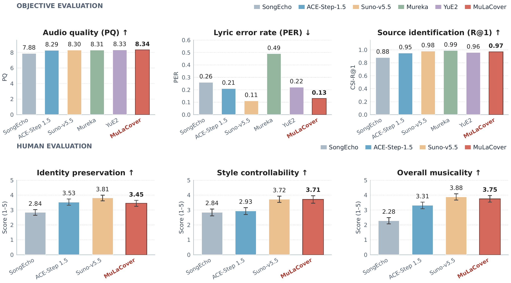
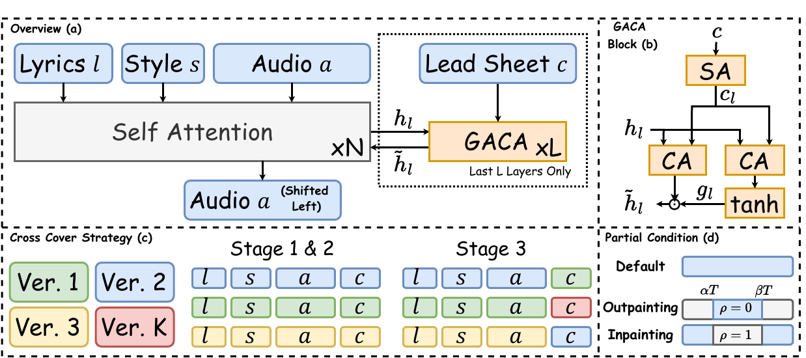

<p align="center">
    <picture>
      <source media="(prefers-color-scheme: dark)" srcset="assets/brand/vera-praxis-white.svg">
      <source media="(prefers-color-scheme: light)" srcset="assets/brand/vera-praxis-black.svg">
      
    </picture>
</p>

<p align="center">
  <a href="https://huggingface.co/HeartMuLa/MuLaCover">Model Weights 🤗</a> &nbsp;|&nbsp;
  <a href="examples/cover_song_generation.md">Generation Guide 🛠️</a>
  <br>
  <a href="https://github.com/HeartMuLa/heartlib">HeartMuLa ↗</a> &nbsp;|&nbsp;
  <span>Paper 📑 — Coming soon</span> &nbsp;|&nbsp;
  <a href="https://discord.gg/2Qj5DXsvh">Discord 💬</a> &nbsp;|&nbsp;
  <a href="LICENSING.md">Licensing ⚖️</a>
</p>

---

# MuLaCover: Flexible Cover-Song & Music Remix Generation

MuLaCover is a controllable AI cover-song and music-remix model. It transforms
reference music using new lyrics and a text style description, or generates
from melody/chord MIDI.

---

## 📊 Results

<p align="center">
  
</p>

<p align="center"><em>Full-song cover generation: objective evaluation across six systems and human evaluation across four systems (mean ± 95% confidence interval; 22 participants).</em></p>

---

## 🧩 Method Overview

<p align="center">
  
</p>

<p align="center"><em>MuLaCover injects a symbolic lead sheet into a pretrained text-to-song backbone through gated adaptive cross-attention.</em></p>

---

## 🔥 Highlights

- **Two control paths.** Start from reference audio, or provide melody and
  chord MIDI directly.
- **Creative remixing.** Keep the original lyrics or supply entirely new
  lyrics while remixing genre, instrumentation, topic, and mood.
- **Symbolic music control.** Reference audio is converted into melody,
  harmony, and optional drum conditions rather than copied frame by frame.

---

## 📰 News

- 🚀 **16 Sep. 2026** — MuLaCover code and model weights are now publicly
  available! Explore the [code](https://github.com/HeartMuLa/MuLaCover), download
  the [model weights and checksums](https://huggingface.co/HeartMuLa/MuLaCover),
  and follow the [generation guide](examples/cover_song_generation.md) to create
  cover songs and remixes from reference audio or melody/chord MIDI.
- 🧩 **11 Sep. 2026** — Released the standalone `mulacover` inference package,
  reference-audio/MIDI workflows, and reproducible deployment guide.

---

## 🛠️ Local Deployment

### Requirements

- Linux with an NVIDIA GPU
- Python 3.10
- A driver compatible with the selected PyTorch CUDA build
- `ffmpeg` and `libsndfile1` for audio input/output

The tested environment is PyTorch 2.10.0 with CUDA 13.0. On CUDA-enabled AWS
Deep Learning AMIs, the global `LD_LIBRARY_PATH` may point to a different CUDA
toolkit. If cuBLAS reports `Invalid handle` or cannot load
`cublasLtGetVersion`, launch MuLaCover with `env -u LD_LIBRARY_PATH` so PyTorch
uses the CUDA libraries shipped in its wheel.

### Installation

```bash
git clone git@github.com:HeartMuLa/MuLaCover.git
cd MuLaCover
conda create -y -n mulacover python=3.10 pip
conda activate mulacover

python -m pip install torch==2.10.0 torchvision==0.25.0 torchaudio==2.10.0 \
  --index-url https://download.pytorch.org/whl/cu130
python -m pip install -e '.[audio]'
python -c "import torch; from mulacover import MuLaCoverGenPipeline; assert torch.cuda.is_available(); print('Ready')"
```

For MIDI-only conditioning, `python -m pip install -e .` is sufficient.

### 📦 Checkpoints

MuLaCover expects one checkpoint root with this layout:

```text
ckpt/
├── MuLaCover/
│   ├── tokenizer.json
│   ├── config.json
│   ├── gen_config.json
│   ├── model.safetensors.index.json
│   └── model-00001-of-00005.safetensors ... model-00005-of-00005.safetensors
├── HeartCodec-oss/
├── Qwen3-Embedding-0.6B/
└── SymbolicTranscriptor/          # only needed for reference audio
    ├── yourmt3/last.ckpt
    └── chord/*.best.sdict
```


MuLaCover model weights and generated outputs are restricted to noncommercial
use under [`MODEL_LICENSE`](MODEL_LICENSE). The Apache-2.0 code license does not
grant commercial rights to the weights or outputs.

```bash
hf download HeartMuLa/MuLaCover --local-dir ckpt/MuLaCover
(cd ckpt/MuLaCover && sha256sum -c SHA256SUMS)
```

Download the public style encoder and codec:

```bash
hf download Qwen/Qwen3-Embedding-0.6B --local-dir ckpt/Qwen3-Embedding-0.6B
hf download HeartMuLa/HeartCodec-oss-20260123 --local-dir ckpt/HeartCodec-oss
```

Reference-audio conditioning additionally needs the YourMT3 and five ChordNet
checkpoints. See [the full generation guide](examples/cover_song_generation.md).

### ✍️ Input format

Use a UTF-8 text file with section markers on their own lines, one lyric line
per line, and a blank line between sections:

<details>
<summary><strong>完整歌词示例 / Full multiline lyrics example</strong></summary>

```text
[Intro]

[Verse]
终于松开紧握过去
不再回头看那阴影
只要眼中倒映我身影
我愿意穿过人海向你奔去
我知道路途不平静
我一直练习呼唤你的姓名
最怕你沉默转身远去

[Chorus]
追梦也需要决心
冲破所有不确定
只要你一点头我坚信
这条路往天明

[Chorus]
我们都需要决心
去拥抱彼此相信
人潮退去我能看清你
刻在我目光里
你的坚定

[Interlude]

[Verse]
终于松开紧握过去
不再回头看那阴影
只要眼中倒映我身影
我愿意穿过人海向你奔去
我知道路途不平静
我一直练习呼唤你的姓名
最怕你沉默转身远去

[Chorus]
追梦也需要决心
冲破所有不确定
只要你一点头我坚信
这条路往天明

[Chorus]
我们都需要决心
去拥抱彼此相信
人潮退去我能看清你
刻在我目光里
你的坚定

[Bridge]
如果我的固执任性
不经意划破了宁静
能不能别急着否定
我虽然走很快
更想与你同行

[Chorus]
追梦也需要决心
冲破所有不确定
只要你一点头我坚信
这条路往天明

[Chorus]
我们都需要决心
去拥抱彼此相信
人潮退去我能看清你
刻在我目光里
你的坚定

[Outro]
```

</details>

Supported section markers include `[Intro]`, `[Verse]`, `[Chorus]`,
`[Interlude]`, `[Bridge]`, and `[Outro]`. Preserve the line breaks; do not add
timestamps or chord names.

Keep style conditioning in one UTF-8 text line using named fields, semicolons,
and bracketed values. Use this exact shape:

```text
topic:[Longing]; genre:[country]; instrument:[Strings,acoustic guitar]; mood:[hopeful]
```

The ready-to-run example inputs are [`assets/lyrics.txt`](assets/lyrics.txt) and
[`assets/tags.txt`](assets/tags.txt). Both `--lyrics` and `--tags` accept either
a text file path or literal text.

### ▶️ Generate from MIDI

```bash
env -u LD_LIBRARY_PATH CUDA_VISIBLE_DEVICES=0 mulacover \
  --model_path ./ckpt \
  --melody_midi /path/to/melody.mid --chord_midi /path/to/chord.mid \
  --lyrics /path/to/lyrics.txt --tags /path/to/tags.txt \
  --save_path /path/to/cover.wav --device cuda:0 --seed 42
```

`--drum_midi` is optional. MIDI timing is read in beats; tempo metadata is kept
for exported MIDI but is not a separate generation condition.

### ▶️ Generate from reference audio

```bash
env -u LD_LIBRARY_PATH CUDA_VISIBLE_DEVICES=0 mulacover \
  --model_path ./ckpt --ref_audio /path/to/reference.mp3 \
  --lyrics /path/to/lyrics.txt --tags /path/to/tags.txt \
  --symbolic_save_dir /path/to/transcribed --save_path /path/to/cover.wav \
  --device cuda:0 --seed 42
```

Lazy loading is enabled by default so the style encoder, MuLaCover model,
codec, and transcription models do not need to occupy GPU memory
simultaneously.

<details>
<summary><strong>Python API</strong></summary>

```python
import torch
from mulacover import MuLaCoverGenPipeline

pipe = MuLaCoverGenPipeline.from_pretrained(
    "./ckpt",
    device=torch.device("cuda:0"),
    dtype={
        "mulacover": torch.bfloat16,
        "codec": torch.float32,
        "qwen": torch.float32,
        "transcriptor": torch.float32,
    },
    lazy_load=True,
)
pipe(
    {
        "melody_midi": "melody.mid",
        "chord_midi": "chord.mid",
        "lyrics": "lyrics.txt",
        "tags": "tags.txt",
    },
    save_path="cover.wav",
    temperature=1.0,
    topk=250,
    cfg_scale=1.5,
)
```

The call writes a WAV file and returns `None`.

</details>

---

## 🙏 Acknowledgements

We thank the [YourMT3 authors](https://github.com/mimbres/YourMT3) and
[Music X Lab](https://github.com/music-x-lab/ISMIR2019-Large-Vocabulary-Chord-Recognition)
for their music-transcription work used in MuLaCover's symbolic-audio frontend.
See [Third-Party Notices](THIRD_PARTY_NOTICES.md) for source attribution,
upstream license links, and local modification notices. Third-party components
remain subject to their respective terms.

---

## ⚖️ License

| Material | License | Commercial use |
| --- | --- | --- |
| Source code and documentation | Apache-2.0 | Permitted under the license |
| Official MuLaCover weights | CC BY-NC 4.0 plus `MODEL_LICENSE` terms | Not permitted without written authorization |
| Outputs generated with official weights | `MODEL_LICENSE` | Not permitted without written authorization |
| Third-party components | Their respective licenses | Depends on the component |

The source-code license does not grant commercial rights to the official
weights or their generated outputs. Read [`LICENSING.md`](LICENSING.md) for the
full licensing map and [`MODEL_LICENSE`](MODEL_LICENSE) for the controlling
weight and output terms.

<details>
<summary><strong>Verified environment</strong></summary>

The table records environments that have actually been exercised.

| Component | Verified configuration |
| --- | --- |
| Operating system | Ubuntu 24.04 |
| Python | 3.10 |
| PyTorch / CUDA wheel | PyTorch 2.10.0 / CUDA 13.0 |
| GPU | NVIDIA B300 |

</details>

---

## 📬 Community

- Explore the foundational [HeartMuLa repository](https://github.com/HeartMuLa/heartlib)
  and read the [HeartMuLa paper](https://arxiv.org/abs/2601.10547).
- Join the [MuLaCover Discord](https://discord.gg/2Qj5DXsvh) for discussion and
  community support.
- Use [GitHub Issues](https://github.com/HeartMuLa/MuLaCover/issues) for
  reproducible bugs and feature requests.
- See [`CONTRIBUTING.md`](CONTRIBUTING.md) before opening a pull request.
- Report security issues through the private process in
  [`SECURITY.md`](SECURITY.md), not through a public issue.

### Join MuLa Labs, Vera Praxis Lab

We are always excited to meet people with a strong interest in audio and music.
MuLa Labs has internship openings for candidates who want to build the next
generation of music and audio technology. To apply, email your resume or CV,
together with a short introduction, to
[contact@mulalabs.ai](mailto:contact@mulalabs.ai).
