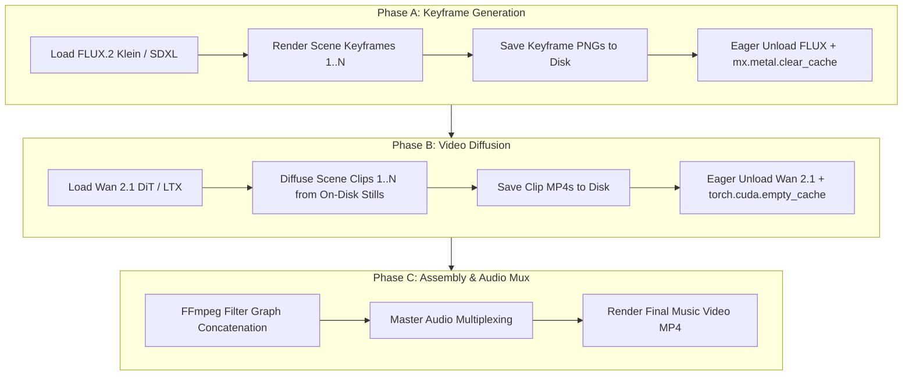

# Cross-Modal Model Lifecycle & Immediate Eviction Architecture

In Milimo Music, neural workflows span three distinct generative media modalities:
- **Audio Generation**: [MiniMax Music 3](../entities/minimax-music3.md), [Stable Audio Open](../entities/stable-audio-open.md), [Meta MusicGen](../entities/musicgen.md), [YuE2](../entities/yue2-music.md), and [HeartMuLa](../entities/heartmula.md).
- **Image Generation**: FLUX.2 Klein (MLX 4-bit), FLUX.1 schnell (Diffusers), and SDXL Turbo.
- **Video Diffusion**: Wan 2.1 DiT (14B / 1.3B I2V and T2V) and LTX-Video (0.9B).
- **Neural Utilities**: BS-Roformer / HTDemucs 6-stem separation, MuScriptor transcription, and Neural SVC.

Because these models require between 2.5 GB and 28 GB of VRAM/RAM individually, allowing models to remain passively resident in memory causes catastrophic resource exhaustion, kernel paging, and Out-Of-Memory (OOM) aborts.

This document defines the **Cross-Modal Model Lifecycle Architecture**, immediate eviction mechanics, and phase-decoupled pipeline execution.

---

## 1. The Cross-Modal Retention Vulnerability

Prior to this architecture, neural pipelines exhibited persistent memory leaks across all three modalities:

1. **Audio**: `_minimax_model` remained resident in unified memory (8–28 GB) because `unload_minimax_model()` was never called after generation.
2. **Image**: `ImageService` held `_loaded_mlx_pipeline` (FLUX.2 Klein, 3–12 GB) and `_loaded_diffusers_pipeline` (6–18 GB) permanently in class fields.
3. **Video**: `diffusers_wan.py` cached Wan 2.1 pipelines permanently in module-level `_WAN_PIPELINE_CACHE` (8–28 GB).
4. **The Director Collision**: In `video_orchestrator.py`, scene rendering interleaved `image_service.generate_scene_background()` with `video_generator.generate_clip()`. This loaded FLUX.2 and Wan 2.1 **simultaneously into the same execution loop**, demanding 36–46 GB+ of concurrent accelerator memory.

```
OLD UNBOUNDED RETENTION (CUMULATIVE):
Audio (15GB) ──> Stems (3GB) ──> Image Still (12GB) ──> Wan 2.1 Video (24GB) = 54GB+ (OOM CRASH)

NEW IMMEDIATE EVICTION (SINGLE ACTIVE WORKLOAD):
Audio (15GB) ──[PURGE ➔ 1.2GB]──> Stems (3GB) ──[PURGE ➔ 1.2GB]──> Video (16GB) ──[PURGE ➔ 1.2GB]
```

---

## 2. Framework-Specific Eviction Protocols

Simply setting a Python variable to `None` fails to free physical accelerator memory due to framework caching allocators and circular closures in acceleration libraries:

### 2.1 Apple Silicon MLX (`mlx.core`)
MLX allocates unified memory pages via its Metal memory pool. When an MLX model is deallocated, Metal pages are retained in cache:
```python
def evict_mlx_model(holder: dict, key: str):
    holder[key] = None
    import gc
    gc.collect()
    try:
        import mlx.core as mx
        mx.metal.clear_cache()
    except Exception:
        pass
```

### 2.2 PyTorch CUDA (NVIDIA)
Hugging Face `diffusers` pipelines with `enable_model_cpu_offload()` attach forward hooks with module closures. These prevent reference counts from dropping to zero:
```python
def evict_diffusers_cuda_pipeline(pipe):
    if pipe is not None:
        if hasattr(pipe, "remove_all_hooks"):
            pipe.remove_all_hooks()
        del pipe
        import gc
        gc.collect()
        if torch.cuda.is_available():
            torch.cuda.empty_cache()
            try:
                torch.cuda.ipc_collect()
            except Exception:
                pass
```

### 2.3 PyTorch MPS (Apple Silicon)
```python
def evict_mps_model(model):
    del model
    import gc
    gc.collect()
    if hasattr(torch.backends, "mps") and torch.backends.mps.is_available():
        if hasattr(torch.mps, "empty_cache"):
            torch.mps.empty_cache()
```

### 2.4 Linux Host Memory Trimming
On Linux, Python deallocations often leave virtual memory pages retained by the `glibc` malloc arena. To return unused heap pages to the OS kernel:
```python
import ctypes
try:
    ctypes.CDLL("libc.so.6").malloc_trim(0)
except Exception:
    pass
```

---

## 3. The Cross-Modal Eviction Bus

The [Global Hardware Coordinator](../entities/hardware-coordinator.md) serves as the authoritative bus for cross-modal lifecycle orchestration.

### 3.1 Modality Domain Partitioning
Every neural workload declares its modality domain:
- `MODALITY_AUDIO_GEN` (MiniMax, Stable Audio, MusicGen, YuE2)
- `MODALITY_AUDIO_SEP` (BS-Roformer, MelBand-Roformer, HTDemucs)
- `MODALITY_AUDIO_TRANS` (MuScriptor / MT3)
- `MODALITY_AUDIO_VOICE` (Neural SVC, MuLaCover)
- `MODALITY_IMAGE_GEN` (FLUX.2 Klein, FLUX.1, SDXL)
- `MODALITY_VIDEO_GEN` (Wan 2.1 DiT, LTX-Video)

### 3.2 Inter-Modality Preemption
When a workload from `Modality B` requests the hardware lock:
1. `GlobalHardwareCoordinator` identifies whether `Modality A` models are currently warm in cache.
2. The coordinator fires registered eviction hooks for `Modality A`.
3. An accelerator sweep (`mx.metal.clear_cache()` + `torch.cuda.empty_cache()`) runs.
4. Execution yields to `Modality B` with 100% of physical accelerator memory available.

---

## 4. Phase-Decoupled Video Director Execution

To eliminate the FLUX + Wan 2.1 memory collision in `video_orchestrator.py`, generation is partitioned into strictly decoupled sequential phases:



---

## 5. Dual Memory Policies: Eager vs. TTL Warm Cache

Users can select the memory management policy via the Model Manager or Telemetry Bar:

| Policy | Behavior | Best Used For | Reload Latency |
|---|---|---|---|
| **`EAGER_UNLOAD`** *(Default)* | Model loads immediately before inference and unloads in `finally:` block. | Consumer laptops (16GB RAM), 8–12GB GPUs, multi-step pipeline. | 3.5s per take |
| **`WARM_CACHE_WITH_TTL`** | Model stays resident for 180 seconds. Resets on each prompt. Auto-evicts when idle or preempted by another modality. | High-VRAM rigs (32GB+), rapid prompt iteration in Studio. | 0.0s (instant take) |

---

## 6. Quantitative Memory Budgets

| Workflow Stage | Active Model | Unmanaged Footprint | Managed Eager Footprint | 16GB Headroom |
|---|---|---|---|---|
| **Boot / Idle** | None | 1.1 GB | 1.1 GB | 14.9 GB |
| **Audio Generation** | MiniMax Music 3 / Stable Audio | 15.2 GB | Peak 15.2 GB $\to$ **1.2 GB** | 14.8 GB |
| **Stem Separation** | BS-Roformer (6-stem) | 18.4 GB | Peak 4.4 GB $\to$ **1.2 GB** | 14.8 GB |
| **MuScriptor Transcription** | MT3 | 20.5 GB | Peak 3.3 GB $\to$ **1.2 GB** | 14.8 GB |
| **Keyframe Stills** | FLUX.2 Klein 9B | 26.5 GB | Peak 7.2 GB $\to$ **1.2 GB** | 14.8 GB |
| **Video Diffusion** | Wan 2.1 DiT (I2V) | 54.5 GB *(Crash)* | Peak **14.2 GB** $\to$ **1.2 GB** | **1.8 GB (Safe)** |
| **Timeline Assembly** | FFmpeg (VideoToolbox / NVENC) | 54.5 GB *(Swapping)* | **0.8 GB** | 15.2 GB |

---

## Related Pages
- [Global Hardware Coordinator](../entities/hardware-coordinator.md)
- [Hardware Auto-Tune & Memory Profiles](hardware-autotune-memory-profiles.md)
- [Generation Provider Abstraction](../entities/generation-provider.md)
- [AI Music Video Studio](../entities/video-studio.md)
- [Stable Audio Open](../entities/stable-audio-open.md)
- [Meta MusicGen](../entities/musicgen.md)
