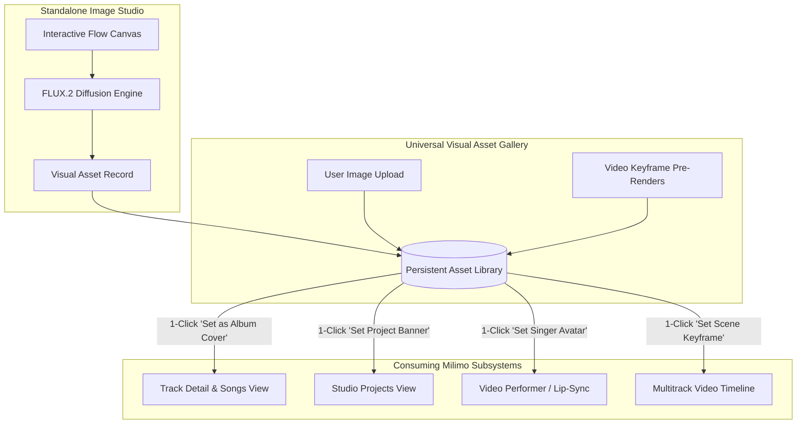

# Standalone Image Generation Studio & Visual Asset Gallery

> [!NOTE]
> The **Standalone Image Generation Studio & Visual Asset Gallery** (`frontend/src/components/views/ImageStudioView.tsx` and `backend/app/services/image_service.py`) is Milimo Music's dedicated creative visual workspace, inspired by Google Flow and modern visual canvas suites. It elevates visual creation into a first-class creative pillar alongside audio and video, providing an interactive generation canvas, persistent asset storage, and universal 1-click routing to album covers, project artwork, and video performer portraits.

---

## 1. Vision & Core Capabilities

Milimo Music compositions previously generated album covers solely as secondary byproducts of song creation. The **Standalone Image Generation Studio** decouples visual art generation from the music synthesis loop, giving artists, producers, and art directors an independent creative environment:

1. **Independent Visual Ideation**: Freely generate visual concepts, moodboards, character turnarounds, and cinematic scenes on demand without needing to synthesize an audio track.
2. **Persistent Visual Asset Gallery**: Every image created in the studio, generated as an album cover, or pre-rendered as a video storyboard keyframe is permanently registered in an indexed database table (`VisualAsset`) and stored on disk.
3. **Google Flow-Style Interactive Canvas**: A responsive, card-based creative workspace featuring live prompt auto-enhancement, visual style presets, aspect ratio switching, seed control, and real-time step-by-step diffusion progress.
4. **Universal Cross-Studio Asset Routing**: Any image in the gallery can be instantly assigned to:
   - **Track Album Cover**: Set as the official cover artwork for any existing song.
   - **Project Artwork**: Assigned as the visual banner and branding for a Studio Project.
   - **Video Performer Portrait**: Routed into the AI Music Video Studio as the face anchor for LivePortrait neural singing avatar lip-syncing.
   - **Scene Keyframe Reference**: Used as visual conditioning for video diffusion clips.

---

## 2. Google Flow-Style Creative Workspace

The Image Studio UI is modeled after Google Flow and pro visual creation tools:

```
┌─────────────────────────────────────────────────────────────────────────────────────────┐
│ MILIMO VISUAL STUDIO                       [🎨 Generate Canvas] [🖼️ Media Gallery]       │
├─────────────────────────────────────────────────────────────────────────────────────────┤
│ PROMPT BAR                                                                              │
│ [ A surrealist neo-noir jazz club bathed in volumetric amber lighting, rain on glass ] │
│ [ ✨ Enhance with LLM ] [ 🎲 Random Seed ] [ Model: FLUX.2 Klein 9B Base ▼ ]            │
├─────────────────────────────────────────────────────────────────────────────────────────┤
│ CREATIVE CONTROLS DOCK                                                                  │
│ Style Presets: [Cinematic Film Still] [Neon Cyberpunk] [Vintage Vinyl] [Anime] [Oil]   │
│ Aspect Ratio:  [1:1 Album Square] [16:9 Cinema] [9:16 Mobile Reel] [4:3 Academy]        │
│ Parameters:    Steps: [ 24 ]  Guidance: [ 3.5 ]  Seed: [ 8492019 ]  True CFG: [ Off ]   │
│ Visual Ref:    [ + Drag Reference Image / Character Sheet from Gallery or Desktop ]     │
├─────────────────────────────────────────────────────────────────────────────────────────┤
│ LIVE DIFFUSION CANVAS & ACTIVE STATUS HUD                                               │
│ ┌─────────────────────────────────────────────────────────────────────────────────────┐ │
│ │                                                                                     │ │
│ │   [ Step 14/24 - Diffusing High-Frequency Details (58%) ]                           │ │
│ │   [████████████████████████████████████████░░░░░░░░░░░░░░░░░░] ETA: 8s               │ │
│ │                                                                                     │ │
│ └─────────────────────────────────────────────────────────────────────────────────────┘ │
│ [ ⏹️ Stop Generation ]                                                                 │
└─────────────────────────────────────────────────────────────────────────────────────────┘
```

### 2.1 Visual Style Presets
The studio provides one-click curated prompt injectors matching professional music genres and visual aesthetics:
- **Cinematic Film Still**: 35mm anamorphic lens, shallow depth of field, Kodak Vision3 500T grain, photorealistic texture.
- **Neon Cyberpunk**: High-contrast volumetric neon lighting, reflective rain puddles, chromatic aberration, Tokyo synthwave aesthetic.
- **Vintage Vinyl / Retro Cover**: 1970s blue note typography, halftones, worn cardboard sleeve texture, gatefold aesthetic.
- **Surrealist Collage**: Dreamlike juxtaposed elements, Dali-esque melting horizons, vibrant pigment saturation.
- **Anime / Manga Aesthetic**: Makoto Shinkai sky gradients, cel shading, fine ink line art, studio Ghibli warmth.
- **Minimalist Studio Photography**: Monochromatic studio backdrop, softbox strobe lighting, clean editorial portraiture.

### 2.2 Aspect Ratio Engine
Supports native aspect ratio conditioning tailored to audio/video production:
- **`1:1` Square ($1024 \times 1024$)**: Standard streaming album artwork (Spotify, Apple Music, Bandcamp).
- **`16:9` Widescreen ($1280 \times 720$)**: YouTube music videos, desktop wallpapers, cinematic thumbnails.
- **`9:16` Vertical ($720 \times 1280$)**: TikTok, Instagram Reels, YouTube Shorts visualizers.
- **`4:3` Studio ($1024 \times 768$)**: Classic CRT aesthetic and documentary press kits.

---

## 3. Persistent Visual Asset Gallery & Media Library

Every generated image is automatically archived in the **Visual Asset Gallery** (`/images` / `/gallery` route):

### 3.1 Data Schema (`VisualAsset`)
```python
class VisualAsset(SQLModel, table=True):
    id: str = Field(default_factory=lambda: f"asset_{uuid.uuid4().hex[:12]}", primary_key=True)
    created_at: datetime = Field(default_factory=datetime.utcnow, index=True)
    title: Optional[str] = None
    prompt: str
    enhanced_prompt: Optional[str] = None
    style: str = "cinematic film still"
    aspect_ratio: str = "1:1"
    width: int = 1024
    height: int = 1024
    seed: Optional[int] = None
    model_id: str = "custom_aitrader_flux2_klein_9b_mlx_4bit"
    steps: int = 24
    guidance: float = 3.5

    # Storage Paths
    file_path: str               # Absolute disk path
    url: str                     # Web URL (e.g. /covers/ai_cover_abc123.png)
    thumbnail_url: str           # Low-res thumbnail for instant gallery rendering

    # Taxonomy & Categorization
    category: str = "concept"    # 'concept' | 'cover' | 'keyframe' | 'character' | 'upload'
    tags: List[str] = Field(default_factory=list, sa_column=Column(JSON))
    is_favorite: bool = False

    # Relational Links
    linked_job_id: Optional[str] = Field(default=None, index=True)
    linked_project_id: Optional[str] = Field(default=None, index=True)
```

### 3.2 Gallery Features
- **Filtering & Search**: Filter by category (`All`, `Album Covers`, `Concepts`, `Scene Keyframes`, `Uploaded Refs`), aspect ratio, or search by prompt text.
- **Instant Lightbox Inspection**: Full-screen zoom modal with complete generation metadata (prompt, seed, steps, guidance, model).
- **Seed & Prompt Cloning**: One-click "Remix in Studio" copies prompt, seed, and style into the generation canvas to iterate on variations.
- **External Image Ingestion**: Users can upload external reference images, character turnarounds, or photo shoots directly into the gallery (`POST /api/image-studio/upload`).

---

## 4. Universal Cross-Studio Asset Routing

The Visual Asset Gallery acts as the central visual provider across the entire Milimo Music DAW:



### 4.1 "Set as Album Cover" Workflow
1. In `TrackDetailView` or `SongsView`, clicking the cover art reveals **"Choose from Gallery"**.
2. The user browses their personal gallery of visual concepts.
3. Clicking **"Apply as Cover"** calls `POST /api/tracks/{job_id}/set-artwork`:
   - Updates `Job.cover_image_path` in SQLite.
   - Mirrors the file into `data/covers/` if necessary.
   - Emits an instant cache-busting timestamp to update all UI track avatars without page reload.

### 4.2 "Set as Video Performer Avatar" Workflow
1. In `MusicVideosView`, the user opens the Character Casting dock.
2. Selecting **"Cast from Gallery"** presents all portrait/character assets.
3. Selecting an asset binds its path to `job.character_image_path`, instantly routing it to the LivePortrait neural singing avatar engine.

---

## 5. Architectural Transfer from Milimo Video

The Image Studio incorporates the core engineering solutions identified during the investigation of `https://github.com/mainza-ai/milimovideo`:

1. **Modality Slot Mutual Exclusion (`MemoryManager`)**:
   - Preparing for image generation calls `GlobalHardwareCoordinator.prepare_for("image")`, systematically unloading heavy video transformers (Wan 14B / LTX-2) or audio language models (HeartMuLa / YuE2) and flushing Metal/MPS cache to prevent out-of-memory crashes on Apple Silicon unified memory.
2. **Apple Silicon MPS VAE Decode CPU-Offload**:
   - Prevents black image artifacts and memory spikes by offloading the VAE decode pass to CPU in `float32` while keeping the main FLUX.2 flow transformer on MPS.
3. **Thread-Safe Denoising Step Callbacks**:
   - Injects `flux_callback(step, total)` into the inference loop, using `asyncio.run_coroutine_threadsafe` to broadcast real-time percentage and step data over SSE while evaluating user cancellations on every step.

---

## 6. Implementation Roadmap

| Milestone | Deliverables | Status |
|---|---|---|
| **Phase 1: Database & Asset Vault** | `VisualAsset` SQLModel table, database migration, asset registration hooks in `image_service.py` for covers and keyframes. | **Ready for Implementation** |
| **Phase 2: Backend REST & SSE API** | `POST /api/image-studio/generate`, `GET /api/image-studio/assets`, `DELETE /api/image-studio/assets/{id}`, `POST /api/tracks/{job_id}/set-artwork`, cancellation hooks. | **Ready for Implementation** |
| **Phase 3: Frontend Image Studio Canvas** | `ImageStudioView.tsx`, Google Flow-style prompt bar, style chips, aspect ratio selector, live diffusion HUD. | **Ready for Implementation** |
| **Phase 4: Gallery & Universal Modal Picker** | Media gallery grid, zoom lightbox, "Choose from Gallery" picker modal integrated into `TrackDetailView`, `SongsView`, and `MusicVideosView`. | **Ready for Implementation** |

---

## Related Documentation

- [AI Music Video Studio](video-studio.md)
- [Video Generation Troubleshooting Handoff](../concepts/video-generation-troubleshooting-handoff.md)
- [Artwork and Static Media Architecture](../concepts/artwork-and-static-media-architecture.md)
- [Global Hardware Coordinator](hardware-coordinator.md)
- [Cross-Modal Model Lifecycle Architecture](../concepts/cross-modal-model-lifecycle.md)
